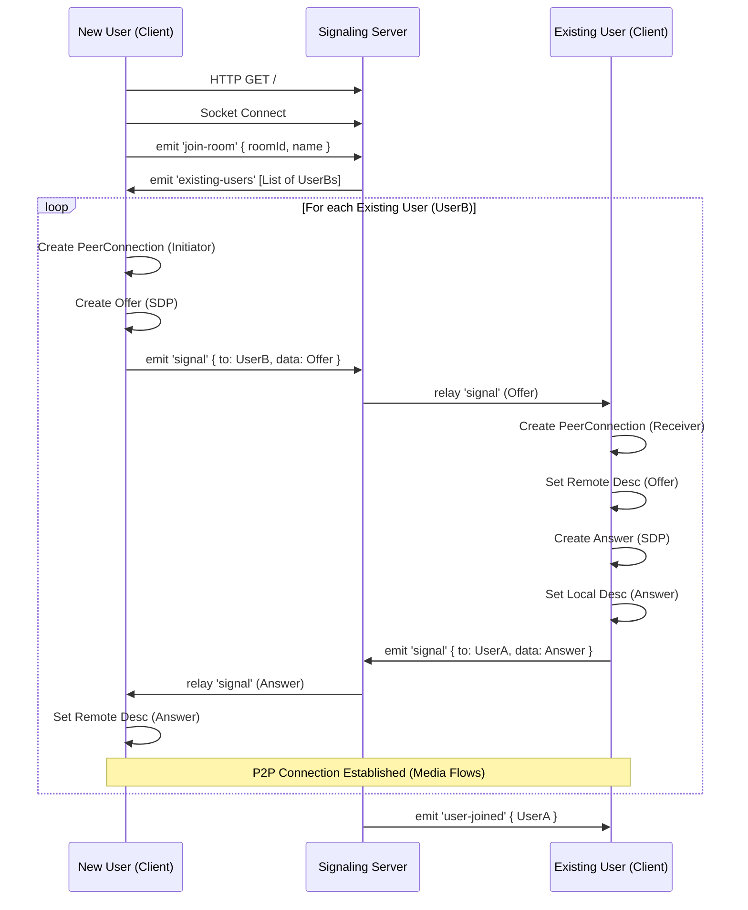

# SkyMeet - Interview Preparation Guide

This document provides a comprehensive overview of the SkyMeet application, its architecture, and key workflows. It is designed to help you understand the codebase for technical interviews.

## 1. Project Overview

**SkyMeet** is a lightweight, browser-based video conferencing application. It allows users to join video meetings instantly without installing software.

**Key Features:**
*   **Real-time Video/Audio**: Low-latency communication using WebRTC.
*   **Mesh Topology**: Direct Peer-to-Peer (P2P) connections between all participants.
*   **Signaling Server**: Uses Socket.IO to exchange connection metadata (SDP/ICE candidates) between peers.
*   **Real-time Chat**: Integrated chat with file sharing support.
*   **Screen Sharing**: built-in capability to share screen streams.
*   **Responsive Design**: Works on Desktop, Mobile, and PWA (Progressive Web App).

---

## 2. Tech Stack

### Frontend
*   **HTML5/CSS3**: Semantic structure, Custom variables (CSS properties), Flexbox/Grid layouts.
*   **Vanilla JavaScript (ES6+)**: No framework overhead (React/Vue/Angular), direct DOM manipulation.
*   **WebRTC API**: `RTCPeerConnection`, `MediaStream`, `navigator.mediaDevices`.
*   **Socket.IO Client**: For real-time signaling and chat.

### Backend
*   **Node.js**: Runtime environment.
*   **Express.js**: Web server for serving static assets and API routes.
*   **Socket.IO Server**: Handles real-time events (`connection`, `disconnect`, custom events).
*   **REST API** (Mock): Simple endpoints for Signup/Login (in-memory storage for demo).

---

## 3. Architecture

### 3.1 Frontend Architecture (`client/`)
The frontend is built as a **Single Page Application (SPA)** feel, though it uses traditional multi-page navigation for simplicity in this version (`/` -> Auth, `/room` -> Meeting).

*   **`auth.html`**: Landing page. Handles User Signup/Login -> Stores user in memory (or local check) -> Redirects to Meeting.
*   **`meeting.html`**: The main video interface. Contains the Video Grid, Toolbar, and Chat Panel.
*   **`app.js`**: The "Business Logic" monolith.
    *   **State Management**: Global variables (`peers`, `localStream`, `socket`, `currentUser`) track the app state.
    *   **DOM Manipulation**: Functions like `addLocalVideo()`, `addRemoteVideo()`, and `appendChatMessage()` directly update the UI.
    *   **Event Listeners**: Attached to buttons (Mic, Cam, Screen Share) to trigger logic.

### 3.2 Backend Architecture (`server/`)
The backend is a **Signaling Server**. It does **not** process video/audio media. Its only job is to helps peers find each other.

*   **`index.js`**:
    *   **HTTP Server**: Serves the HTML pages.
    *   **Socket.IO**: Listens for connection events.
    *   **Rooms**: Uses `socket.join(roomId)` to group users.
    *   **Relay**: When User A sends a "signal" (offer/answer), the server forwards it to User B. It does not inspect the payload.

---

## 4. Key Workflows & Flow Charts

### 4.1 Connection & Meeting Join Flow
This flow explains how a user enters a room and connects to existing participants.



### 4.2 Chat Architecture
The chat system is broadcast-based within a specific room.

```mermaid
graph TD
    A[User A] -->|Type Message| UI[Chat Input]
    UI -->|Click Send| JS[sendChatMessage()]
    JS -->|Socket.emit 'chat-message'| Server[Node.js Server]
    
    Server -->|Validation| Check{Room Exists?}
    Check -- Yes --> Broadcast[io.to(roomId).emit]
    
    Broadcast -->|'chat-message' Event| A[User A]
    Broadcast -->|'chat-message' Event| B[User B]
    Broadcast -->|'chat-message' Event| C[User C]
    
    B -->|Receive Event| Append[appendChatMessage()]
    Append -->|Update DOM| ChatUI[Chat Box UI]
```

### 4.3 WebRTC Signaling (The "Handshake")
WebRTC requires a complex handshake to effectively stream media through firewalls (NAT traversal).

1.  **ICE Candidates**: As the browser finds network paths (Video via WiFi, Ethernet, or TURN server), it generates "candidates".
2.  **Exchange**: These are sent via Socket.IO to the peer.
3.  **Connection**: Once a valid path is found, the video starts playing.

**Code flow in `app.js`:**
1.  `pc.onicecandidate`: "I found a path!" -> Send to Server.
2.  `socket.on('signal', ...)`: "Peer found a path!" -> `pc.addIceCandidate()`.

---

## 5. Frequently Asked Questions (Interview Q&A)

**Q1: Why do we need a server if WebRTC is Peer-to-Peer?**
*   **Answer**: WebRTC needs a "Signaling Channel" to set up the call. Computers don't know each other's IP addresses or capabilities (codecs). The server acts as the introducer. Once connected, media flows directly between users.

**Q2: What topology is this? (Mesh vs SFU vs MCU)**
*   **Answer**: SkyMeet uses a **Mesh** topology. Every user connects directly to every other user.
    *   *Pros*: Cheap server (very little CPU/Bandwidth).
    *   *Cons*: High bandwidth upload for clients. Doesn't scale well beyond 4-6 users (N*(N-1) connections).

**Q3: How does the Chat work?**
*   **Answer**: It uses WebSockets (Socket.IO). When a user sends a message, it goes to the server, which broadcasts it to everyone else in that `roomId`. It is *not* stored in a database (ephemeral).

**Q4: How is "Screen Sharing" implemented?**
*   **Answer**: We use `navigator.mediaDevices.getDisplayMedia()` to get the screen stream. Then, we find the "Video Sender" in the existing WebRTC PeerConnection (`pc.getSenders()`) and use `replaceTrack()` to swap the camera track with the screen track. This seamless switching is a powerful WebRTC feature.

**Q5: What happens when a user leaves?**
*   **Answer**:
    1.  User clicks "Leave".
    2.  Socket disconnects.
    3.  Server detects disconnect -> Emits `user-left` to room.
    4.  Other clients receive `user-left` -> Search for that Peer ID in their `peers` object -> Close Connection -> Remove Video Element from DOM.

---

## 6. Directory Structure Summary

*   **`/client`**: All frontend assets.
    *   `app.js`: Main logic (WebRTC + UI).
    *   `style.css` (or internal styles): Look and feel.
*   **`/server`**: Backend Logic.
    *   `index.js`: Entry point, Socket.IO logic.
